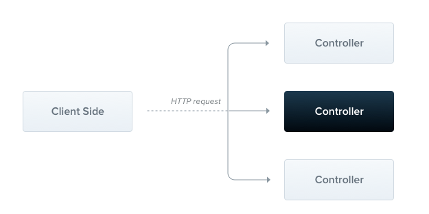
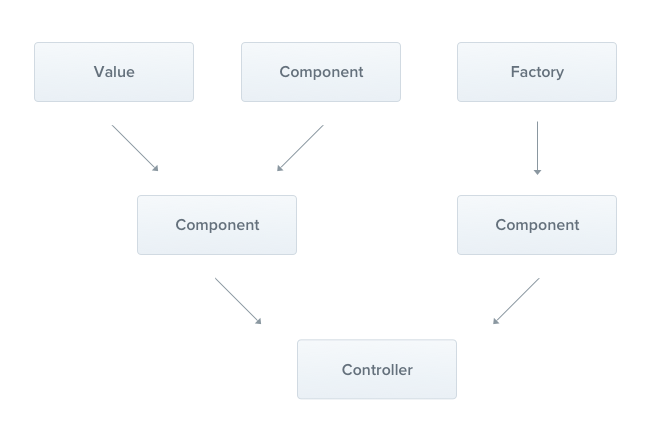

Controllers
Controllers are responsible for handling incoming requests and returning responses to the client.

Create Module : nest g control users
Create Controller: nest g controller users
Create Provider : nest g service users

# CRUD API :

```py
@Get() // GET /users or /users?role=value
  findAll(@Query('role') role?: 'INTERN' | 'ENGINEER' | 'ADMIN') {
    return [];
  }

  @Get(':id') // GET /users/:id
  fineOne(@Param('id') id: string) {
    return { id };
  }

  @Post() // POST /users
  create(@Body() user: {}) {
    return user;
  }

  @Patch(':id') // PATCH /users/:id
  update(@Param('id') id: string, @Body() userUpdate: {}) {
    return { id, ...userUpdate };
  }

  @Delete(':id') // DELETE /users/:id
  delete(@Param('id') id: string) {
    return { id };
  }

```

Providers
Providers are a fundamental concept in Nest. Many of the basic Nest classes may be treated as a provider – services, repositories, factories, helpers, and so on. The main idea of a provider is that it can be injected as a dependency;
Create Provider : nest g service users
